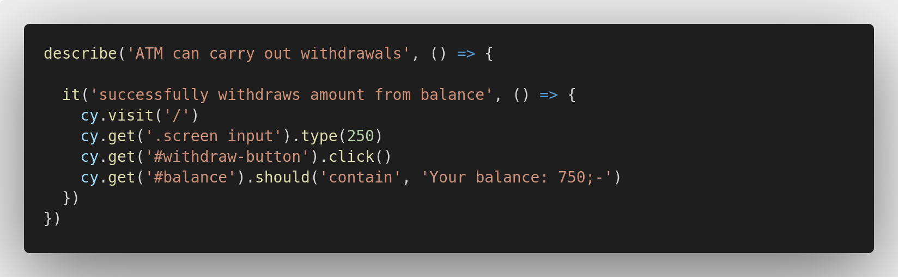
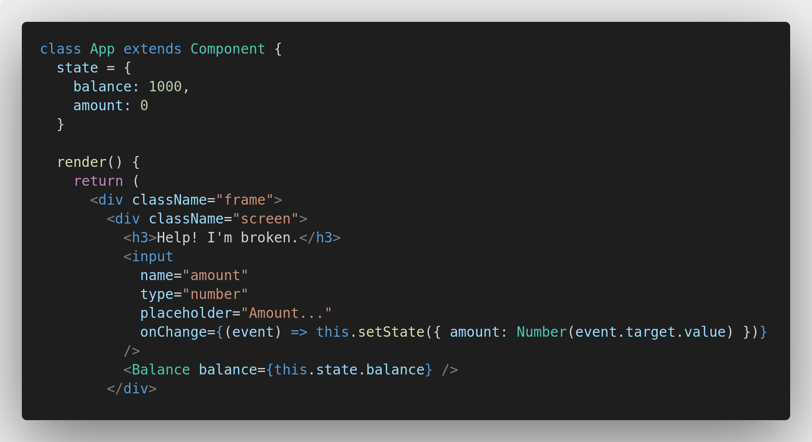

## Withdrawing
It's time for us to get that cash money - and why not keep practising a smart work flow at the same time!
1. User Story
2. Test
3. Implementation

A User Story for this feature could look something like this:
```
As a user
In order to retrieve digital cash
I need to be able to withdraw money from the ATM
```

So, let's ponder the functionality for a second. We would like the user to be able to withdraw money by typing in an amount in the main ```input field``` and then clicking the ```withdraw``` button. Under the hood, the typed in amount will be subtracted from the user's balance and, since we just made the ```balance``` dynamic, it should also display an updated value. 

**Knowing this, we can create a new test file and write the first test like so:**

```
$ touch cypress/integrations/atmTransactionfunctionality.feature.js
```



Let's go through the logic real quick: 
- We visit our site
- We use a ```selector``` that grabs the element with a ```class``` of ```screen``` and, within this, looks for the first ```input``` element - and type 250
- Then we grab the ```withdraw-button``` and click it
- And expect ```balance``` to now display 750;-

**Super! Or, I mean, Cypress is complaining again. So let's make her happy!**

Before we can create the actual withdraw functionality, we need to be able to access the value that the user has typed into the input field.  
A cool way to solve this is to add an ```onChange``` event listener to the ```input field``` and store its value in a state, like this:



To begin with, we create a new ```state``` object, called ```amount```, and set its default value to **0**. 
But what's more interesting is what is happening in the ```onChange``` callback function.

Basically, every time the ```input field``` changes, we update the ```amount``` state with a value equal to ```event.target.value```.   Event listeners and event handlers are cornerstones in making the web dynamic and you will be practising these a lot throughout the boot camp. 

Finally, since the value is of type `string`, but we want to use it as a `number` in our future calculations, we are parsing the value with the `Number()` constructor.  
*(There's multiple ways to convert a string to a number. `parseInt(<string>)` is one other way, or pre-fixing the string with a `+`, like `+<string>`)*

### The withdraw function
Now that we have access to the amount, we can write our ```withdraw``` function. The logic itself is quite simple; we want to deduct ```amount``` from ```balance```.  
However, we also need to build interactivity, which means that we need to update the ```balance``` state, and also add an event listener to the withdraw button that triggers the ```withdraw``` function.


In this case we add an `onClick` event listener to the withdraw button. When clicked, it fires off the new `withdraw` function which, in turn, will update the balance. 

**This should make our test go green. Feels good!**

## Depositing
While receiving cash is definitely favorable, we remain dedicated to build full functionality - so let's get at it!

**User Story first:**
```
As a user
In order to fill up my balance
I need to be able to deposit money through the ATM
```

Then we go back in our ```atmTransactionfunctionality``` test, revise the ```describe``` block, and add a new test, like so: 


Now, if you're up for it, try to make that new test block pass by yourself!  
It's really good practice to challenge yourself, as this is when the puzzle truly starts to resolve.

If you get stuck, the solution lies below.


### Tweaks
Just before we move on, let me introduce you to another way of storing the `input value` in a `state` that doesn't update (and re-render) the component for every keystroke. 

The function is called `onBlur()` and is an event listener that will be fired when the `input field's` `focus state` changes from being "active" to being "inactive". 

When we click the `input field` (which by the way triggers an `onFocus()` listener), type in an amount, and then click one of the buttons; the second we click that button, focus is removed from the `input field` - triggering the `onBlur()`. Pretty cool, right? 

Let's change the `onChange()` to an `onBlur()`!