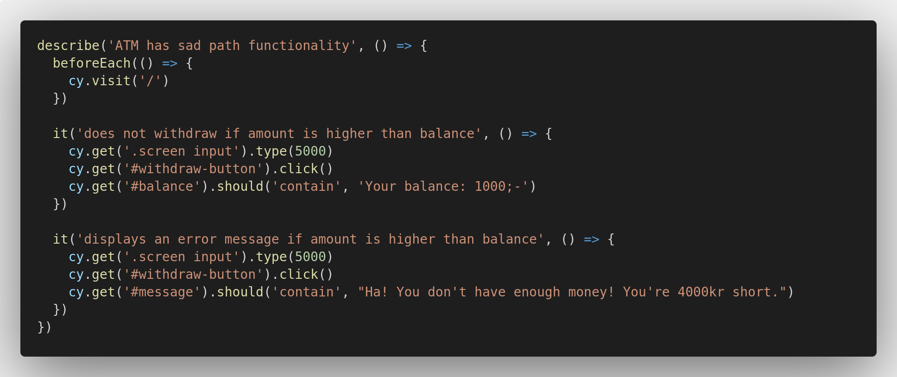
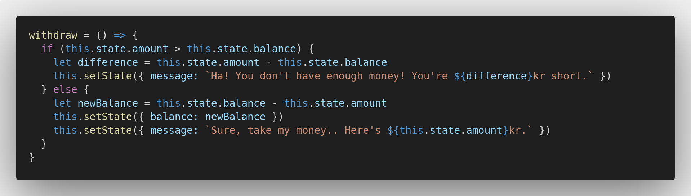
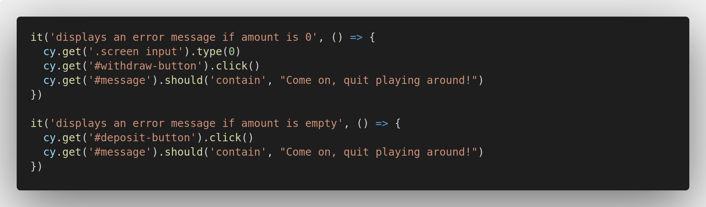

*Distant echoes of developers crying out in frustration...*

*Nasty bugs crawling around your feet...*

*Rivers of tears...*

The sad path is indeed a gloomy place!  

Yet, as new, aspiring developers, we need to get comfortable in this somber place, as it is a path we need to walk over and over again. 

**Light your torches and let's head out.**

## Writing conditionals
Working on the sad path most often entails adding conditionals to your code:

*If this is the case, do that.*

*If this is not the case, then don't show this, but show that instead.*

... And so forth. If you had any doubts, sad path revisions can of course be formulated as User Stories too!

```
As an ATM
In order to avoid overdraft
I should not make withdrawals if amount is higher than balance
```

With this, let's create a new test file and call it `atmSadPathFunctionality.feature.js`:



As you may have guessed, in order to make these tests go green, we need to wrap our `withdraw` logic inside of an `if else` statement.

If we rewrite the function into something like this, the tests should pass!



**Splendid! First obstacle complete. Let's head further down the path..**

Next up, we'll work on halting the transaction if `amount` is 0 or left empty.

```
As an ATM
In order to avoid unnecessary transactions
I should not make transactions if the amount evaluates to 0
```

Back in our sad path test file, we'll add two more test blocks:



For this final obstacle, it's time to venture out on your own two legs; make those two tests pass!

*Come back victories - or not at all!*

.. Just kidding of course. If you need assistance, just reach out!

When complete, run the entire test suite and watch all 10 tests light up in green saturation!  

Well done. The functionalities used throughout this exercise are the very pillars to the realm of React, and mastering these is the first step in becoming a proficient React developer.  

If you have time on your hands, I encourage you to go through the exercise again and try to accomplish as much as you can without checking the documentation!

## Recap
For good measure, let's just go over the concepts we worked with:
- **States.** In order to be able to display dynamic content, we stored information inside states. 
- **Handling Events**. In order to create interactivity, we created event listeners and event handlers. Based on user input, we make modifications to the states, enabling the dynamic flow.
- **Props**. In order to let child components have access to the state values of a parent, we passed the value down as a prop. 