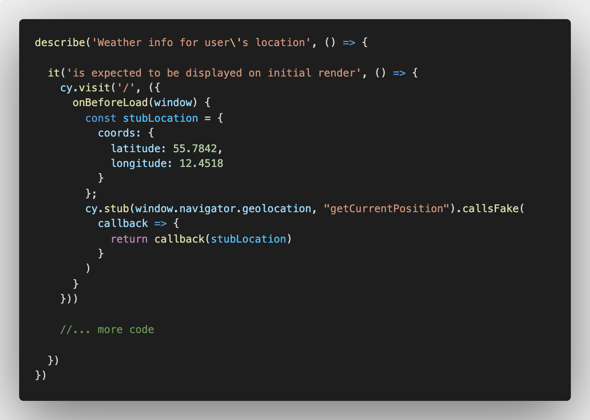
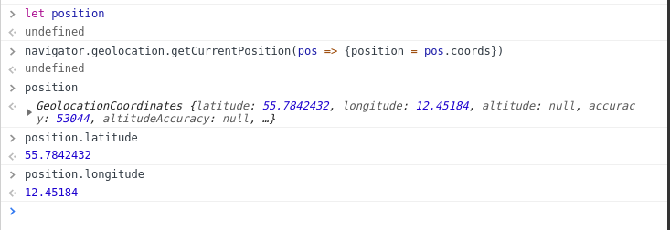

It's time to get a bit more serious with Cypress. As mentioned, we'll be working with something called *stubbing* and *mocking*, which equals to `cy.stub` and `cy.router` in Cypress-language. 

They may seem intimidating at first, but you'll become friends soon enough, don't worry. Let's try to take it as we go and practice some **learning by doing**.

## Setting the stage
Before we start playing around with the new concepts, we need to write some standard tests and think about what we actually want to do. 

And can you think of a better way to get the ball rolling than by writing a User Story? I think not:
```
As a user
In order to better be able to plan my day
I want to see the temperature for my current location 
```
As for the visual part, there's not that much to this one; we want an app to render an element that displays the temperature - as well as the user's location, ideally. 

A test for this functionality is also pretty straight forward:
```
describe("displays weather info for user's location", () => {

  it('on initial render', () => {
    cy.visit('/')
    cy.get('[data-cy="weather-display"]').within(() => {
      cy.get('[data-cy="temp"]').should('contain', '17°C')
      cy.get('[data-cy="location"]').should('contain', 'Virum')
    })
  })
})
```

This may or may not be new to you, but in this challenge we'll be using `data-cy` as reference points.  

Cypress sees this way of referencing as best practice since its sole purpose is to work as an access point for your tests. Using classes, ids, or other element selectors are subject to potential changes in your implementation code. Maybe you (or another developer even) decide that the `header` element shouldn't have a `class='header'`, but instead an `id='hero-section'`. This will cause the tests to fail and cause commotion. 

So, while we have to add an extra attribute to our elements, it might help us further down the line when we go back to the code and revise - or hand the code over to another team.

Also, here's the celsius symbol: `°C`. 

## Stubbing
The test above implicitly assumes that the `temp` and `location` contain fixed values. However, since what we want is to access the user's geolocation and then display the temperature and location for that specific user, we would actually get different values for every user. 

**So how do implement dynamic code while maintaining a consistent outcome in our tests?**

Great question!  
We use [cy.stub](https://docs.cypress.io/api/commands/stub#Syntax) - which is a test stub used to simulate a certain behavior that your app depends on. And what kind of behavior are we dependent on? In other words, what kind of functionality is responsible for making our code unique for the user?

**That's right, the `latitude` and `longitude` from the `navigator.geolocation.getCurrentPosition()` function!**

In Cypress, the `cy.stub` goes in, jams the targeted function, and replaces the outcome with a predetermined outcome. Furthermore, `cy.stub` is leveraging on the [Sinon.js](https://sinonjs.org/) framework and supports all Sinon methods.  
Let's take a look at the solution and then go through the logic: 



Hooold on, that's a whole lot of new stuff! 

It is indeed, so let's stay put and break down the moving parts:

1. `cy.visit` has a main role of visiting a URL, but it can also take [optional arguments](https://docs.cypress.io/api/commands/visit#Arguments) to modify its behavior. We're using the `onBeforeLoad()` function which calls its code block before the page has loaded all of its resources.
2. Inside the code block, the first thing we do is creating the variable, `stubLocation`, containing the stubbed value. Notice that we format it to mimic the outcome that we got earlier:



3. With the stubbed value defined, we move on to create the actual stub.  
`cy.stub` takes 2 arguments, the first being the object that 'owns' the function to be stubbed out, and the second being the actual function.  
We then chain this with a `callsFake()` method (from Sinon) that allows us to manipulate the `return` of `getCurrentPosition`. The `callsFake()` method is a bit complicated as it takes a callback function as an argument - that takes another callback function as an argument... So let's not think about that too much!

Alright! With that done, let's head into implementation.