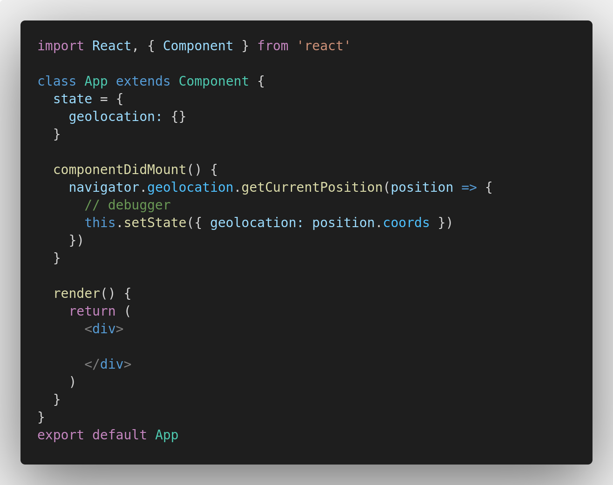
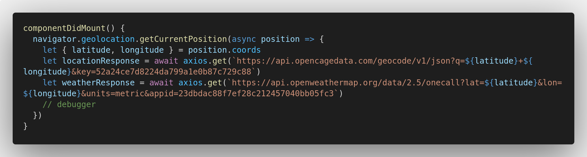
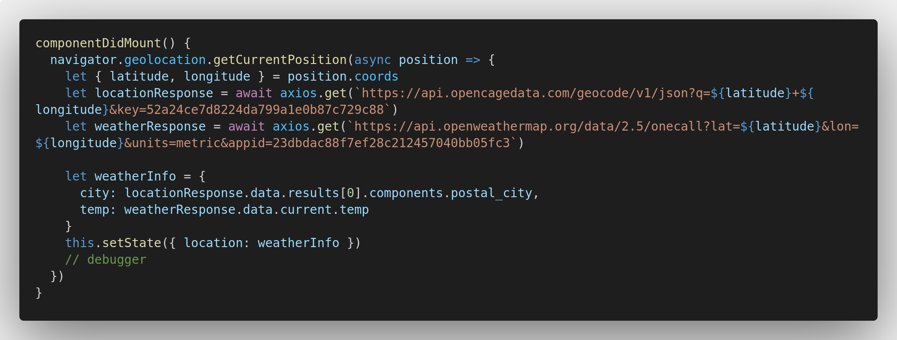
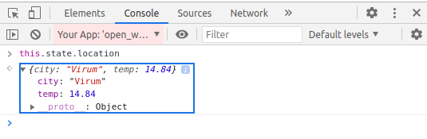

### Time for functionality!
Let's go through the control flow one more time:  
1. Extract the user's geolocation.
2. Send requests to the location and weather API with the geolocation as params.
3. Store the API responses in our state.
4. Display the appropriate information on our site

Maintaining an overview like this is good practice to avoid getting stuck and keeping an efficient work flow throughout. With that said, let's get on with it!

## Getting user's position
As we have practiced previously, when we want to display information on our site's initial render that is based on API calls, we can use `componentDidMount()`. 

**Define a state to contain the user's position, and, other than that, it's just carrying out the same code as we did back in *Prerequisites*.**



Put a debugger in as showed (that's not commented out) and have a look at the `position` object for yourself!

## Fetching temperature and location data
Now that we hold the user's `latitude` and `longitude`, it's time to make those API calls.

First, install Axios and import it in `App.jsx`
```
$ yarn add axios
```

Now, we actually want to revise out code a bit. Instead of storing the user's geolocation in a state and then later using the state's information to make the API calls, we can actually do it directly within the `getCurrentPosition()` and skip a step!



First, we extract the user's position using `destructuring`, which you should be familiar with by now. Basically, it's just a more handy way of writing:
```
let latitude = position.coords.latitude
let longitude = position.coords.longitude
```
Next, we write the API requests using `string interpolation` to inject the `latitude` and `longitude` into the `query params`. The last param holds the API key, and notice that we also include a param of `units=metric` in the request to Open Weather. This will give us temperature in celsius instead of fahrenheit. 

Finally, as we always need to `await` axios requests, we add this keyword before the call as well as the `async` keyword before the `position` argument.

**Super! Check out the responses using the `debugger` and you should see some sweet data.**

Staying in the debugger, it's time to do some exploration. On our site, we want to display the temperature and the location - i.e. the city - so let's dig these values out from the responses and store them in our state.

**Take 5 minutes to try to dig them out yourself!**

It is, of course, a possibility just to store the entire responses in our state, but it's best practice to keep it as clean as possible. We can always add more data to the state as we progress.

Be mindful when you are searching for the city object, since Open Cage's response is actually inconsistent on this. In my case, `postal_city` will retrieve my city, but in your case it may very well be called something else, like `city`. This is of course something we will have to address later on.

To start with, make sure that it fits your own response.
```
// .. still inside the getCurrenPosition()

let city = locationResponse.data.results[0].components.postal_city
let temp = weatherResponse.data.current.temp
this.setState({ location: {city: city, temp: temp} })
```

This will work, but let's refactor this to be more readable as well as making it more efficient to add additional data to the state in the future:



Go ahead and check `this.state` with the `debugger` and you should see your city and the temperature! Should look something like this:



Superb! That means that we're ready to render some visuals!