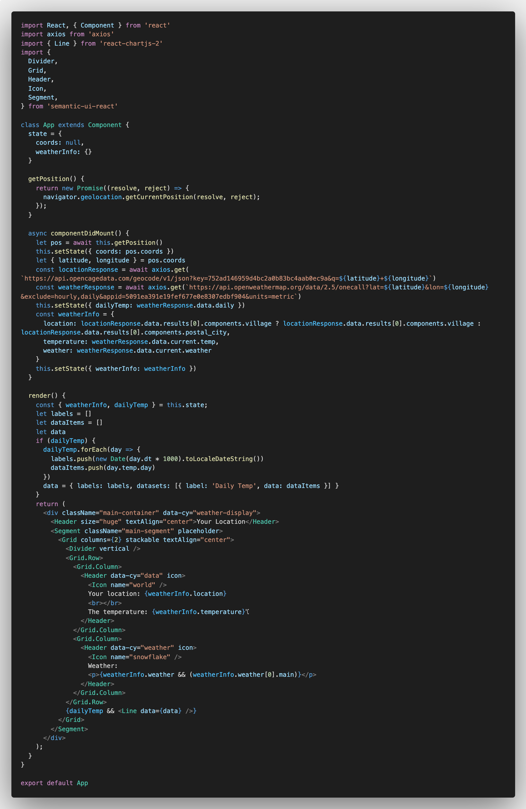
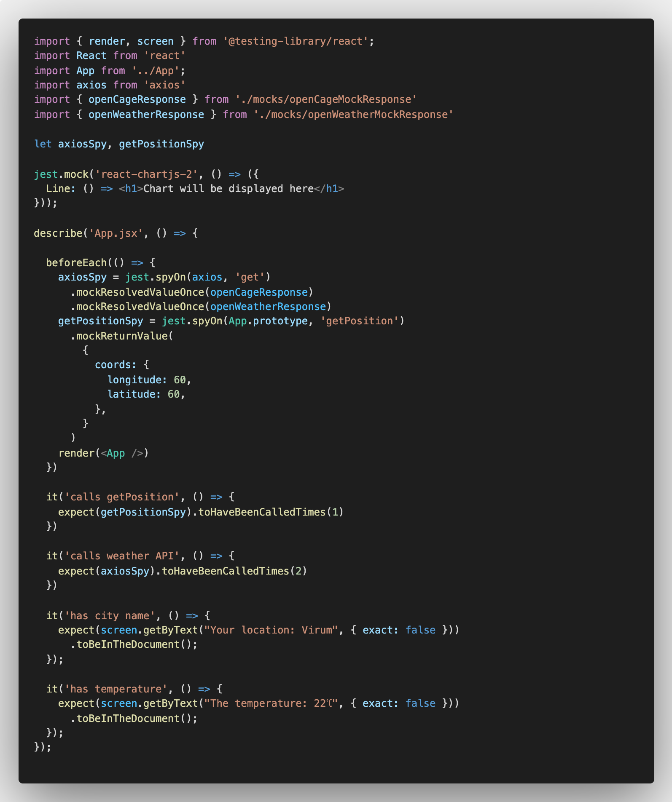

## If it doesn't challenge you, it won't change you.
Here's 3 super duper cool challenges for you:

1. Find one other piece of information from the weather response that you find relevant and display that too. (Remember the TDD flow!)

2. Add conditional logic to the way you define the `city` variable. What should happen if the user's location doesn't have a `postal_city` object? (This can be tested too, i.e. by creating a new `cy.intercept `(scoped for this specific test) that responds with a different `fixture`)

3. Fix sad path functionality for what happens if the user refuses to show his/her geolocation. The `try...catch` statement could come in handy here! (You don't have to write tests for this part, but if you do, you'll gain extra mutch developer-rep-points!)

4. **Take a shot at the following alternative implementation and see if you can crack the code of component tests... That's the topic of a workshop you'll gonna have to endure during this week, so you might as well prepare for that.**

