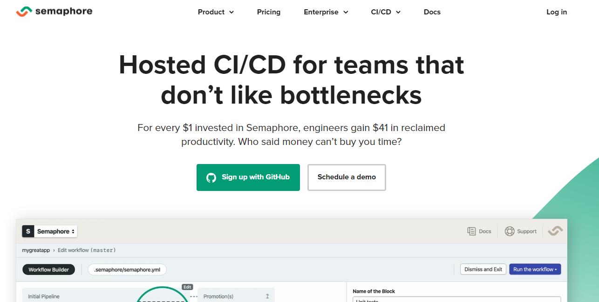
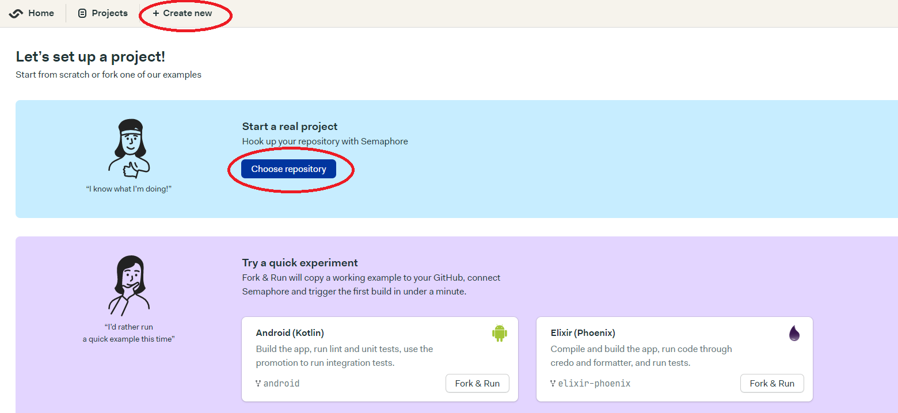
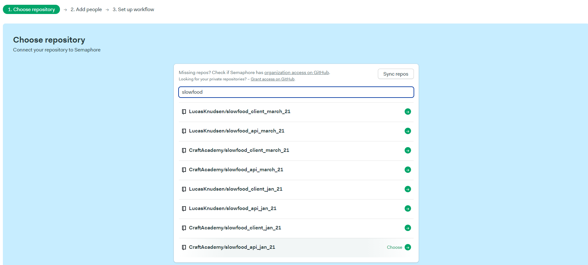
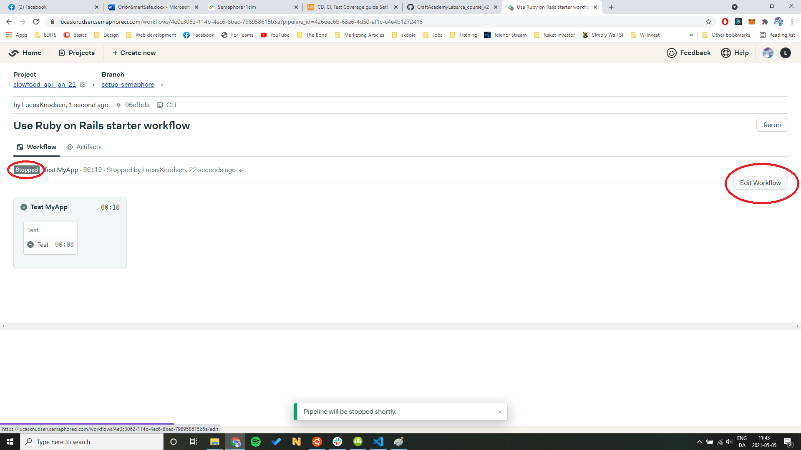
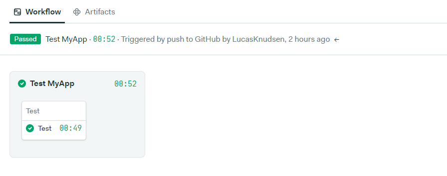

## Setting up Continous integration with Semaphore

Visit the Semaphore's [website](https://semaphoreci.com/). 



If you don't already have an account, set one up with Github

While signing up you might be blocked by an 'abusive-filter'. If this is the case, you'll have to send a mail to that specified address in the error message. Make sure to include your GitHub email in that message!   

### Setting up a new project
- Click the "Create new" button and then "Choose repository".



- At this stage you should have been prompted to give Semaphore access to your GitHub account. If by some reason you still don't see any repos, go to your profile settings up in the right corner and check permissions. If your Public repos are indeed connected, but you still don't see anything - contact a coach!
- Proceed to select the repo you want to use.



### Workflow

- Now we need to configure the test environment. Choose the "Ruby on Rails" starter workflow and then click "Looks good, start". 
- Semaphore has issues when we click Customize before the workflow has been run the first time, so use this flow even if you know you want to customize the configurations.


- This will start the testing automatically, but we need to tweak the config a bit, so stop the test and click "Edit Workflow"



Inside the Jobs container, replace the content with this:

```
checkout
sem-service start postgres 11
sem-version ruby 3.0.0
cache restore
bundle install --deployment --path vendor/bundle
cache store
bundle exec rake db:setup
COVERALLS_REPO_TOKEN=your_coveralls_token bundle exec rails ci:tests
```

Change `sem-version ruby` to your local ruby version and replace the coveralls placeholder with your token.

Now "Run this workflow" which should initiate a new test run. If you have any strange errors here, contact a coach.


- And voila!




