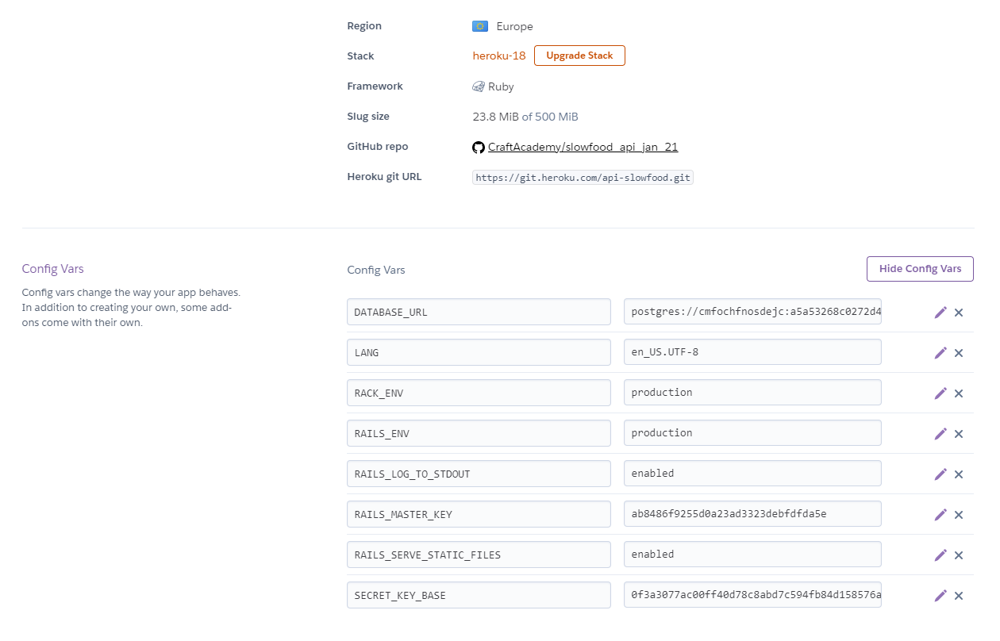
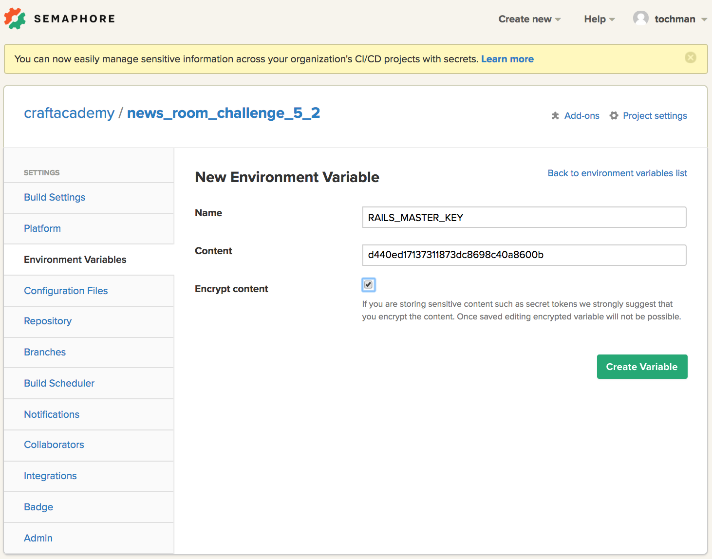

Rails handles management of application secrets and credentials in a secure way. They are encrypted and stored in `config/credentials.yml.enc`.

# The Master Key
The encrypted `credentials.yml.enc` file will be decrypted in production using a key stored either in the `RAILS_MASTER_KEY` environment variable, or in a key file. In development environment the application uses your local ``config/master.key`` to decrypt the data.

This key file is created for you when you scaffold your new Rails app using the ``rails new`` command. If it doesn't exist, a key will be created when you run ``rails credentials:edit.``

Note that it's safe to check in the encrypted file (``credentials.yml.enc``) to VCS but you should never push up your ``master.key``. This file is (and should be) excluded from version control per default. Check your ``.gitignore`` to make sure it is there.

You should also note that, without the master.key file present in your project's ``config`` folder, you will experience errors. This might happen, for example, when you fork and clone an existing project (since the ``master.key`` isn't pushed up) and try to run ``rails db:setup`` (or equivalent).

# Adding credentials
As mentioned, credentials are saved and encrypted in ``config/credentials.yml.enc``. You can not, and should not attempt to access or modify this file directly.  

To add credentials to your application, run this command in your terminal (change the name of you editor if you need)

```
EDITOR="code --wait" rails credentials:edit
```

This will open up the credentials file in your code editor, decrypted, and will look something like this:

```yml
# aws:
#  access_key_id: 123
#  secret_access_key: 345

# Used as the base secret for all MessageVerifiers in Rails, including the one protecting cookies.
secret_key_base: 84fd6106329678ce7c098f66b7770463f7de50658339f221f8a662d64557295e7b6977c32cba10a00a573868799d9adb04f6e783acc31ef56704161572d9ee3b
```

The credentials are stored in the YAML format and can be grouped by nesting keys.. Let's modify this by removing the comments and adding a key and a value.

```yml
foo: 
  bar: foo-bar
# or
monkeylearn_key: 4ffaf487f8545as678sd
```

Then, when you close the file in your editor, you should be prompted in the terminal with the following message:

```
New credentials encrypted and saved.
```
# Generating a new master.key
There might come a time where you will have to work on an old application that's using credentials, but where the ``master.key`` has been lost. Unfortunately, there's no way to retrieve this lost key, so you will have to generate a new key as well as a new credentials file. 

To do this, run the same code line as earlier, but make sure that you have removed the existing `credentials.yml.enc` file before:

```
EDITOR="code --wait" rails credentials:edit
```

Now, you should have a new ``master.key`` as well as a fresh credentials file - meaning that all previous credentials has been wiped. Hopefully, these can be retrieved by the team - otherwise you'll have to go out and fetch new ones. 

# Using credentials
The key value pair we added to the credentials file is available for us to use in our application through the ``Rails.application.credentials`` object. To check if our additions has been encrypted properly, let's open up the rails console and try to access (decrypt) the values.

```
$ rails c
Loading development environment (Rails 5.2.0.rc1)
[1] pry(main)> Rails.application.credentials.foo[:bar]
=> "foo-bar"
[2] pry(main)> Rails.application.credentials[:monkeylearn_key]
=> "4ffaf487f8545as678sd"
```

In your application, whenever you need to add a credential that is sensitive, you can now call the Rails.application.credentials and get the value you need without having it displayed publicly in your code.

# Using the Master Key on Heroku
The easiest way to make encrypted credentials work on Heroku is to grab the passcode stored in ``config/master.key``, and use it to set up a ``RAILS_MASTER_KEY`` environment variable. This section is found under `settings -> config vars` of your Heroku Dashboard.



You can also add the variable using Heroku CLI.
```
$ heroku config:set RAILS_MASTER_KEY=`cat config/master.key
```

The Heroku CLI command ``$ heroku config`` outputs a list of the config variables that you have added to your application. Run that command in your terminal to check if your ``RAILS_MASTER_KEY`` variable has been added properly.

# Using the Master Key on CI
In order to be able to use encrypted credentials on your CI Service (SemaphoreCI, TravisCI, CircleCI or whatever your choice might be), you need to go through a similar process as adding the Master Key to production in the form of a ``RAILS_MASTER_KEY`` environment variable.

## SemaphoreCI
If you use SemaphoreCI for continuous integration, you need to add a ``RAILS_MASTER_KEY`` environment variable in Project Settings.

Navigate to ``Project settings -> Environment Variables -> Project specific Environment Variables`` and click the ``Add +`` link.

Add your variable in the panel.  

