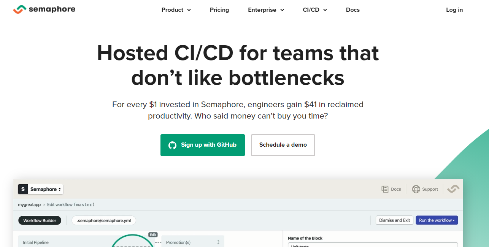
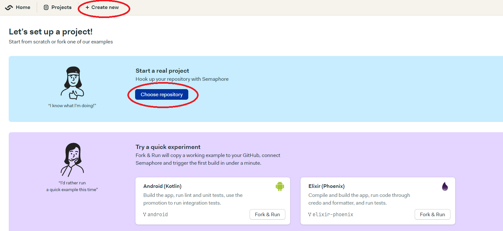
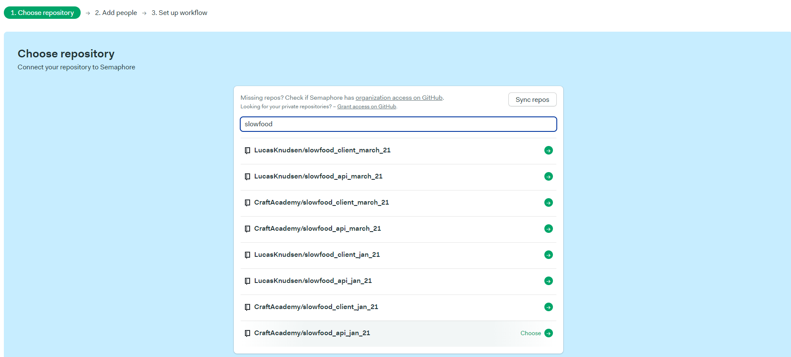
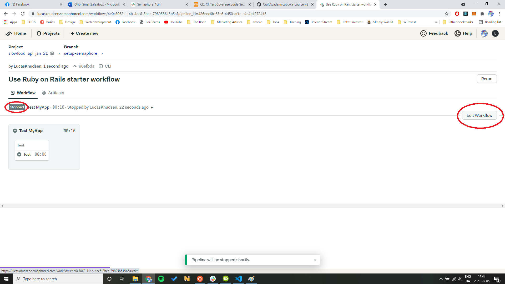
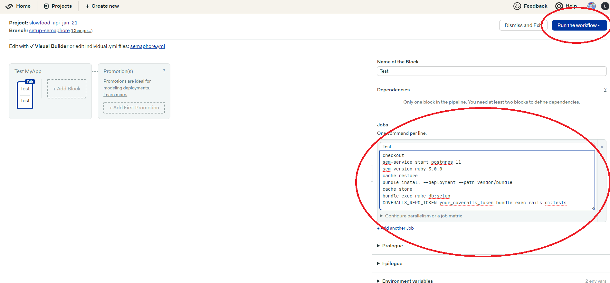
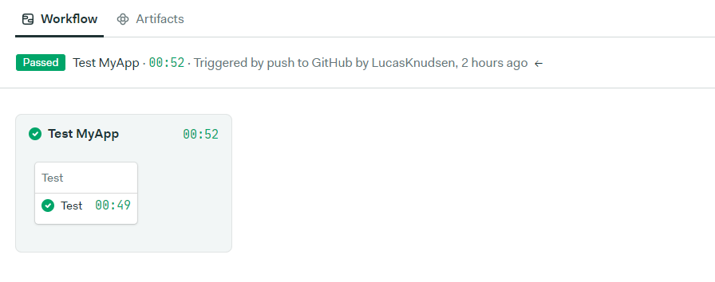
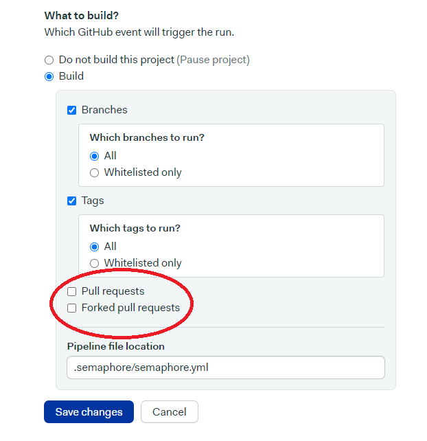
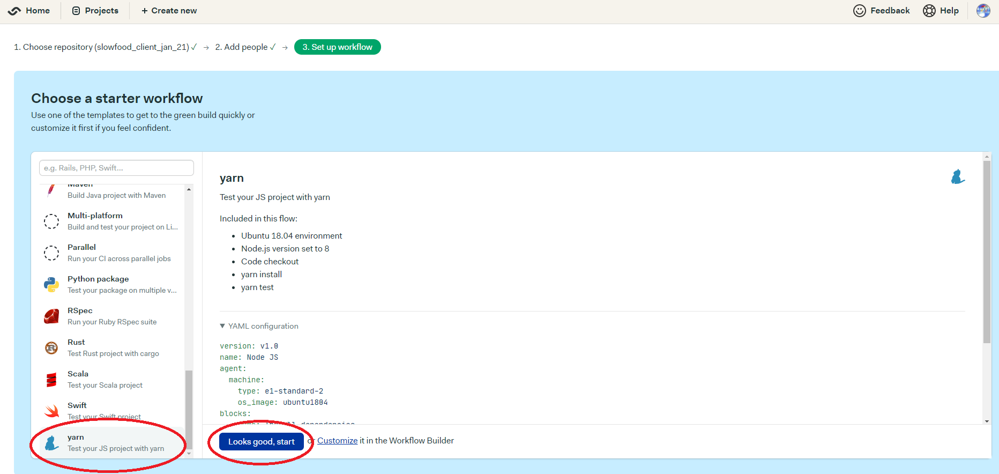
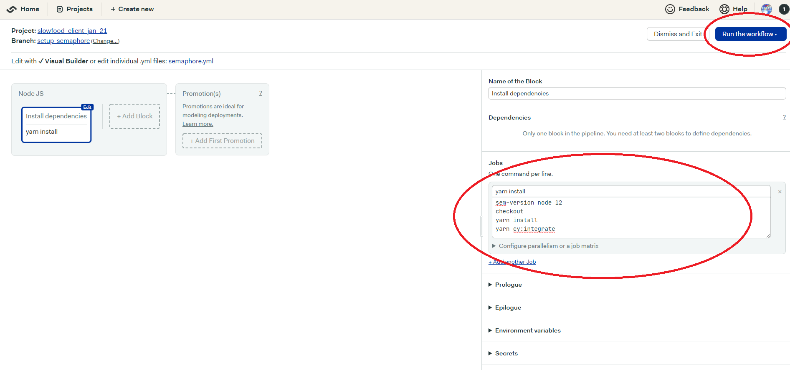

The following guide assumes that you have an upstream repository on Craft Academy's Github account, if that is not the case for you then just ignore the parts about adding the "Craft Academy repository" and set your repository there instead. It also assumes that you're using RSpec for testing Ruby on Rails and Cypress for a React client.

In this guide, we will show you how to set up three services that will work together, Semaphore, CD with Heroku and Code Climate.

**Semaphore** is testing your code all the time and keeping software quality high. The premise of CI is to get feedback as early as possible because the earlier you get feedback, the easier things become to fix.

In software development, when multiple developers or teams are working on different segments of the same web application, we need to perform an integration test by integrating all modules. To do that an automated process for each piece of code is performed on a daily basis so that all your code gets tested.

**Continuous Deployment with Heroku** is about getting code into production in an automated way. Things should be easy and repeatable. That’s where Continuous Deployment comes into play. The deployment should not be manual. Every time we add some new code to our application it should deploy that new code automatically.

**CodeClimate** is a web service to help you track your code coverage over time, and ensure that all your new code is fully covered. You can use it for various programming languages and in this guide, we will use it for Ruby. In a later guide we will use it to measure code coverage in React.

# Coverage with Code Climate
Code Climate can automatically track your coverage, but it relies on separate tools to do the actual analysis of how much of your code is being tested. Add the following gem to your `Gemfile` in the `:development` and `:test` group

```rb
group :development,  :test  do
  gem 'simplecov',  require:  false
end
```

``Run bundle install``

Next, we need to add simplecov to our testing suite. Add the following lines at the top of the `rspec` configuration file

```rb
# spec/rails_helper.rb for RSpec

require  'simplecov'
SimpleCov.start
```

Now whenever we run our tests, a coverage report will be generated. *NB: Do not track this report in version control! You will need to add the following to your gitignore:*
```
# .gitignore

coverage/
```

----------


# Setting up Continous integration with Semaphore
At this stage we need to set up CI for both the client and the api.
## For the API

Visit the Semaphore's [website](https://semaphoreci.com/). 



If you don't already have an account, set one up with Github

While signing up you might be blocked by an 'abusive-filter'. If this is the case, you'll have to send a mail to that specified address in the error message. Make sure to include your GitHub email in that message!   

### Setting up a new project
- Click the "Create new" button and then "Choose repository".



- At this stage you should have been prompted to give Semaphore access to your GitHub account. If by some reason you still don't see any repos, go to your profile settings up in the right corner and check permissions. If your Public repos are indeed connected, but you still don't see anything - contact a coach!
- Proceed to select the repo you want to use.



### Workflow

- Now we need to configure the test environment. Choose the "Ruby on Rails" starter workflow and then click "Looks good, start". 
- Semaphore has issues when we click Customize before the workflow has been run the first time, so use this flow even if you know you want to customize the configurations.


- This will start the testing automatically, but we need to tweak the config a bit, so stop the test and click "Edit Workflow"



Inside the Jobs container, replace the content with this:

```
checkout
sem-service start postgres 11
sem-version ruby 3.0.0
cache restore
bundle install --deployment --path vendor/bundle
cache store
bundle exec rake db:setup
COVERALLS_REPO_TOKEN=your_coveralls_token bundle exec rails ci:tests
```

Change `sem-version ruby` to your local ruby version and replace the coveralls placeholder with your token.

Now "Run this workflow" which should initiate a new test run. If you have any strange errors here, contact a coach.



- And voila!



This process will create a PR to the chosen repo. Make sure to get this PR merged (by you or the coaches) and then pull down to your local project to make sure the new ``semaphore.yml`` file will be added in future PRs.

Now, as the final thing, head over to the project's settings tab, scroll down and make sure to tick in these two checkboxes. Just go with the default settings of the "Forked pull requests".



## For the client
The config looks a bit different for the client. 

To start with we need to create a script for Semaphore to utilize. In your local app, go to `package.json` and add the following scripts:

```js
"cy:run": "cypress run",
"cy:integrate": "start-server-and-test start:silent http://localhost:3001/ cy:run",
```
Make sure this is pushed up to the repo before you proceed.

### Workflow for Cypress
We'll also be using a different workflow for the client. 

- In the box to the left, search for `yarn` or scroll all the way to the bottom. 

- Select this starter workflow and click "Looks good, start".



- Once again we click "stop pipeline" and "Edit Workflow". In the Jobs container, we change the content to this:
```
sem-version node 12
checkout
yarn install
yarn cy:integrate
```



Remember to change the build settings for pull requests - and that should do it for the client! 

# Setting up Continous Deployment with Heroku

- You need to have created a Heroku application, we will go over this in a demo this week. If we have not delivered that demo yet, skip this part for now.

- Go to your Heroku dashboard and click on ur project.

- Go to the deploy settings tab and activate Github as the applications deployment method

- Underneath that option you should now be able to connect the Heroku application to a specific repo(your rails_demo application).


- Now you need to decide which branch you want to be deployed, pick the master branch

- Now click the button that says "Enable Automatic Deploys"


# Setting up Continous Deployment with Netlify
Setting up Netlify should be a breeze for you at this point - just remember to rewrite your `build` script with this line when you're implementing different routes:

`"build": "react-scripts build && echo '/* /index.html 200' | cat >build/_redirects",`

**DONE!!**
