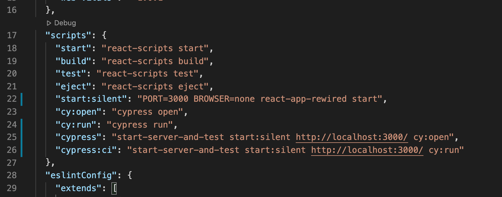

This guide is similar to the last, but targets a frontend React application. Make sure you've done the previous CI CD Coverage coursework for a Ruby on Rails api backend before moving on.

All that being said, let's show off a little by getting a Code Climate test coverage percentage for our React apps!

---

Just as for Rails, we will use **Semaphore** and **Code Climate**. But as you've probable already guessed, we need to adjust the commands we make Semaphore execute. The **Code Climate** implementation is identical to the last guide, so go ahead and add your React repo and save the `CC_TEST_REPORTER_ID`

---

Head over to **Semaphore** and create a new project, just the same as when you set one up for your Rails backend. Once you've selected the repo and added people you want to set up your workflow. Select the Node.js template, as it's the closest to what we want to do:

You guessed it, we have to edit the jobs section:


Edit it as follows:

```
sem-version node 16.13.2
checkout
curl -L https://codeclimate.com/downloads/test-reporter/test-reporter-latest-linux-amd64 > ./cc-test-reporter
chmod +x ./cc-test-reporter
./cc-test-reporter before-build
yarn install
yarn cypress:ci
```

Change the `Epilogue` to this:

```
./cc-test-reporter format-coverage -t lcov
```

Then the `job passed` to:

```
./cc-test-reporter after-build --exit-code 0
```

And the `job failed` to:

```
./cc-test-reporter after-build --exit-code 1
```

Now look at the environment variables. This time around we only need one, `CC_TEST_REPORTER_ID`, and just like before you get it from **Code Climate**, though make sure that you get it from the frontend repo project on Code Climate!

Now we want to run the workflow. Edit the branch name to `development` if that is what you are using on your github. Go ahead and start it:


Now this will of course fail. This is because we have issued a bunch of commands on Semaphore that are not yet integrated with our app. Let's fix that next, but before we do navigate over to your github and see if Semaphore made a commit to your `development` branch. If yes you need to pull that down (it includes a `.semaphore` directory with some configuration).

---

### Code Coverage for a React App:

In Rails we were blessed with `simplecov`, but life in javascript-land is never that easy. To allow Semaphore to run a command to generate a report that Code Climate can read we need to install a bunch of new development dependencies and alter the scripts in our `package.json`.
Run the following command in your terminal:

```
yarn add @cypress/code-coverage babel-plugin-istanbul customize-cra react-app-rewired --dev
```
Your `package.json` development dependencies should now look something like this:

If so, let's turn our attention to the `package.json` scripts. If you are using `cypress` and `start-server-and-test`, then the following should look familiar:

A couple of notes: `start:silent` needs to now trigger `react-app-rewired` instead of `react-app-scripts`. We've added some headless `cypress` scripts (you can try these in your terminal to run Cypress in a similar way to jest or Rspec, sans browser).

Good stuff, now we need to create a new file in our root directory by running:
```
touch config-overrides.js
```
Here is what that file should contain:


Okay now it gets trickier, we're going to customize our Cypress a little bit. In `cypress/support/index.js`, import `@cypress/code-coverage/support` as follows:


We also need to inlcude `@cypress/code-coverage` in `cypress/plugins/index.js` as follows:


All of that is a lot. Let's do a sanity check by running `yarn cypress` and running all your tests. If all of the above was implemented correctly, you should see two new directories in your root folder: `coverage` and `.nyc-output`. Take a quick moment to celebrate this win. 

Actually let's celebrate it further by opening up the lcov report in a browser by running `open coverage/lcov-report/index.html`. Nice.

But we are not done yet! Before heading back to the world wide web we don't want to track these test coverage reports. Add both `coverage` (if it's not already there) and `.nyc_output` to your `.gitignore`.

Let's commit all that and push it up.
___

Now head back to **Semaphore** and make sure that the build is passing. If it's failing, make sure that you are building from the right branch and that the correct job commands are being used.

Great, head over to **Code Climate** to confirm that it can read the test coverage output:

And don't worry about that C, this React app retained `reportWebVitals` but did not test it at all:

Explore the Code Climate portal to see what part of your app is not being tested. Then grab the badge for your repo's `README.md` and you are done!