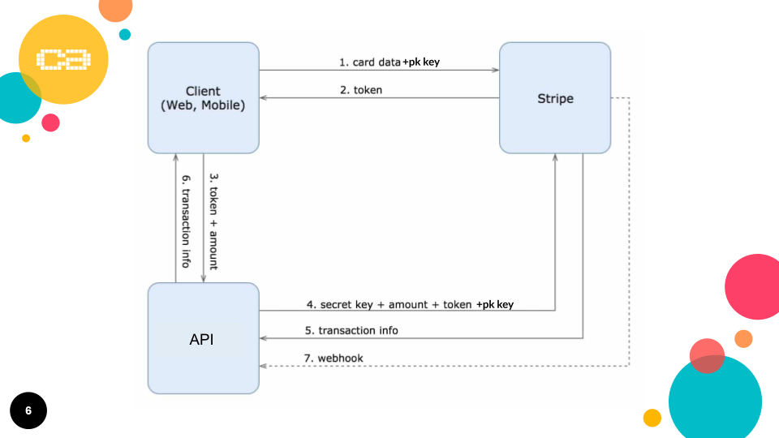

This is a guide to help you implement Stripe as a payment method in your frontend React client. 

# Getting Paid with Stripe in React



We will focus on steps 1, 2, 3 & 6. So we will call (and stub out) the Stripe API as well as our own API. 

### User Story

If you are currently working on the newsroom challenge, then a possible user story could be that the 
user wants to pay a fee to access certain content, such as the body of an article, or perhaps a special category of articles. Here we will assume the former, that an unsubscribed user can access the titles of all the articles, but not view the full article without being subscribed. 

```
As a user
In order to view full articles
I would like to be able to subscribe
```

That will do for our purposes, but keep in mind that many of the steps below will closely resemble any SaaS application.

### Writing our test

Before we go running off looking for a Stripe React dependency we need to first write a test. Let's call it `userCanSeeArticleBySubscribing.feature.js`. 