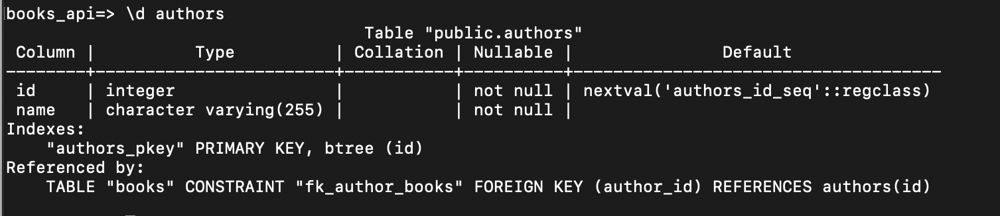
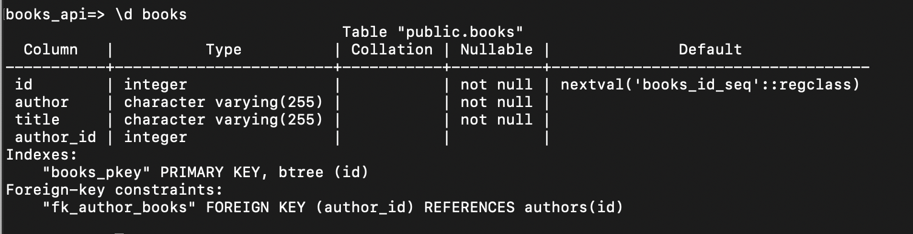
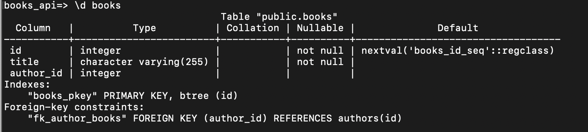
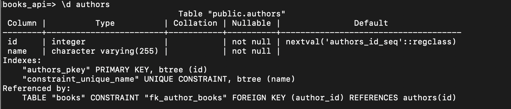

## Author as an associated resource

What if...?

What if we would like to alter our database and add a relationship that would allow a BOOK to `belong_to` an AUTHOR, and allow an AUTHOR to `have_many` BOOKS? That would open up for some more interesting functionality and a better data structure. 

We can run some experiments in the console to learn about what kind of queries we need to use.

Let's start by creating a new table for authors: 

```sql
CREATE TABLE authors ( 
 ID SERIAL PRIMARY KEY,
 name VARCHAR(255) NOT NULL
);
```

And add a foreign key to the ´books` table: 
```sql
ALTER TABLE books ADD COLUMN author_id INTEGER;
ALTER TABLE books ADD CONSTRAINT fk_author_books FOREIGN KEY (author_id) REFERENCES authors (id);
```

Let's take a look at both tabels in greater detail:
```
 \d authors
```



```
 \d books
```



We will have to remove the column `author` that we added in the first part of this exercise.

```sql
ALTER TABLE books DROP COLUMN author;
```

If we take another look at the `books`table, we should see that the column is gone:



Okay, time to add our authors to the `authors` table:

```sql
INSERT INTO authors (name) VALUES ('J.K. Rowling'), ('A. Lindgren'), ('T. Ochman');
SELECT * FROM authors;
 id |     name     
----+--------------
  1 | J.K. Rowling
  2 | A. Lindgren
  3 | T. Ochman
(3 rows)
```

Now, we will update our books with authors. This will be a bit tedious, but it needs to be done:

```sql
UPDATE books SET author_id = (SELECT id FROM authors WHERE authors.name = 'A. Lindgren') WHERE books.title = 'Adventures of Pippi Longstocking' RETURNING *;
 id |              title               | author_id 
----+----------------------------------+-----------
  2 | Adventures of Pippi Longstocking |         2
(1 row)
```

We have to repeat this for every row in our `books` table. You can, if you want alter this statement to ise `id` instead of `name` and `title`. Also, please note that we added `RETURNING *` at the end of the query. Try removing that to figura out what it does for us....

At the end your `books` table should only have rows that include a reference to the `authors` table. 

```sql
books_api=> SELECT * FROM books;
 id |              title               | author_id 
----+----------------------------------+-----------
  3 | Getting Started With NodeJS      |         3
  4 | Fun With ExpressJS and Postgres  |         3
  1 | Harry Potter                     |         1
  2 | Adventures of Pippi Longstocking |         2
(4 rows)
```

Well, with this query, we will not get the name of the author. That is not wat we want. Try this query insted: 

```sql
books_api=> SELECT books.id, books.title, authors.name 
FROM books 
INNER JOIN authors 
ON authors.id = books.author_id;
 id |              title               |     name     
----+----------------------------------+--------------
  3 | Getting Started With NodeJS      | T. Ochman
  4 | Fun With ExpressJS and Postgres  | T. Ochman
  1 | Harry Potter                     | J.K. Rowling
  2 | Adventures of Pippi Longstocking | A. Lindgren
(4 rows)
```

We can also modify this query to filter through books based on the name of the author. Consider this: 

```sql
books_api=> SELECT books.id, books.title, authors.name 
FROM books 
INNER JOIN authors 
ON authors.id = books.author_id 
WHERE books.author_id = (SELECT id FROM authors WHERE authors.name = 'T. Ochman');
 id |              title              |   name    
----+---------------------------------+-----------
  3 | Getting Started With NodeJS     | T. Ochman
  4 | Fun With ExpressJS and Postgres | T. Ochman
(2 rows)
```

**Don't you just LOVE a good old fashined Object Relational Mapper now?**

Okay, but let's say we hava a parameter of a title and author name sent to us and we have to update both the `books` table and the `authors` table? 

We would need to add a validation to the `authors` table to make sure that the name is unique. 

```sql
ALTER TABLE authors ADD CONSTRAINT constraint_unique_name UNIQUE (name);
```

And if we now take a closer look at that table, we should see that the constraint has been added:



This means that if we try to INSERT an author that alseady exists, we will get an error:

```sql
books_api=> INSERT INTO authors (name) VALUES ('T. Ochman');
ERROR:  duplicate key value violates unique constraint "constraint_unique_name"
DETAIL:  Key (name)=(T. Ochman) already exists.
```

This error might cause some trouble for us if we use this query from our application. We would have to modify it:

```sql
INSERT INTO authors (name) VALUES ('T. Ochman') ON CONFLICT (name) DO NOTHING RETURNING *;
 id | name 
----+------
(0 rows)
```

Now, the problem with this is that we WILL need the id of the author if we want to be able to Insert a row inot the `books` table. Hmm... How about this?

```sql
books_api=> INSERT INTO authors (name) VALUES ('T. Ochman') ON CONFLICT (name) DO UPDATE SET name = excluded.name RETURNING id;
 id 
----
  3
(1 row)
```

Okay, so this will help us construct a query that will add a book with a reference to ann author. It could look something like this: 

```sql
WITH authors AS (INSERT INTO authors (name) VALUES ('T. Ochman') ON CONFLICT (name) DO UPDATE SET name = excluded.name  RETURNING id)
INSERT INTO books (title, author_id) VALUES ('A Brand New World Of SQL', (SELECT authors.id FROM authors));
```

Note, if you need to delete the last book, use this query:

```sql
DELETE FROM books WHERE id IN(SELECT max(id) FROM books);
```

If we now check what books we have in our database, we should see something like this: 

```sql
books_api=> SELECT books.id, books.title, authors.name                                                                                           
FROM books                                                                                                 
INNER JOIN authors 
ON authors.id = books.author_id;
 id |              title               |     name     
----+----------------------------------+--------------
  3 | Getting Started With NodeJS      | T. Ochman
  4 | Fun With ExpressJS and Postgres  | T. Ochman
  1 | Harry Potter                     | J.K. Rowling
  2 | Adventures of Pippi Longstocking | A. Lindgren
  5 | A Brand New World Of SQL         | T. Ochman
(5 rows)
```

We can also add a `ORDER BY` to sort our rows.

```sql
books_api=> SELECT books.id, books.title, authors.name                                                                                           
FROM books                                                                                                 
INNER JOIN authors 
ON authors.id = books.author_id
ORDER BY books.id ASC;

 id |              title               |     name     
----+----------------------------------+--------------
  1 | Harry Potter                     | J.K. Rowling
  2 | Adventures of Pippi Longstocking | A. Lindgren
  3 | Getting Started With NodeJS      | T. Ochman
  4 | Fun With ExpressJS and Postgres  | T. Ochman
  5 | A Brand New World Of SQL         | T. Ochman
(5 rows)
```

We are only scratching the surface of what we can do in SQL, but I'd say it again: **Don't you just LOVE a good old fashined Object Relational Mapper now?**

Let's put these queries to use in our application.


